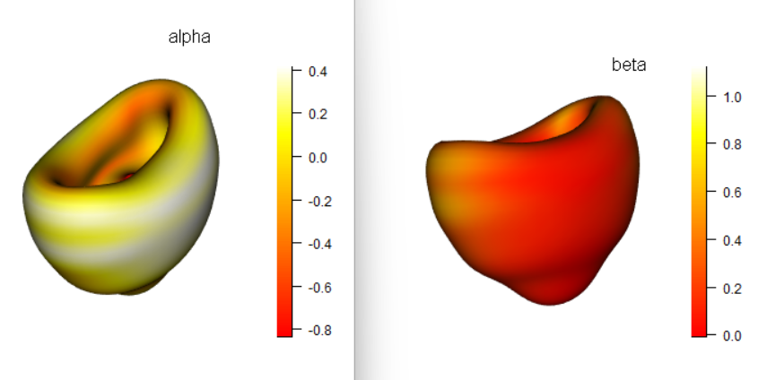

```{r, message=FALSE, warning=FALSE, include=FALSE, paged.print=FALSE }
knitr::opts_chunk$set(  collapse = TRUE,  comment = "#>"
                      , out.width = "100%", out.height="50%")

```

MemRBC - the R package for spectral shape modeling of red blood cells, (C) 2025 Stephan Frickenhaus

## Background

MemRBC is the Red Blood Cell Membrane shape virtual research lab. This document aims at facilitating the first use of MemRBC. Also some background is given on numerical methods and implementation details.

The core of MemRBC is a spectral numerical model of cellular shape, based on spherical harmonics. This means that the membrane shape is represented as real-valued coefficients $A$ of a series of spherical harmonics. It is important to know that $A$ as well as gradients of energy $G$ have 3 columns, each for one spatial dimension. Thus, the matrix of spatial points $X$ can be computed by a matrix-matrix products as $X=Y*A$ . The spatial dimension is always the second index, and $Y$ are the precomputed spherical harmonics for spherical coordinates $(u_i,v_i)$ covering the 2D angular space $(0...\pi,0...2\pi)$. The number of spatial points $i=1...N$ is dictated by the integration scheme. The standard scheme implemented here is a Gauss-Legendre-Simpson scheme, in which the $v-$ angle is discretized equidistantly by Simpson rule, and $u$ are given at Gauss-Legendre points. The latter scheme avoids spatial points at the north and south pole. In consequence, in 3D surface plots one may locate the two poles as tiny holes. It is suggested to have more points in v-direction as to oversampling. Unfortunately, the Gauss-Legendre $u$ concentrate at the poles, leading to a bias in shape. In some cases it may help to down-weight these points with spatial weights \$WX=sin(grd\$U)\$ for example in least-squares-fits

MemRBC provides many low-level functions to create the relevant objects and perform the numerical computation, like for energy, gradient and Hessian.

The energy functional and its gradient are computed in spherical harmonics space, based on differential geometry first and second fundamental, evaluated at the integration points. The Hessian of energy is computed as forward finite difference of the gradient and symmetrized later. In the Hessian, the active constraints are included, i.e. the Hessian is taken from the full Lagrangian, not from energy alone.

## Numerical Methods

Here we list the currently implemented numerical Apps and their features.

Apps enabling additional curvature constraint ("C") require the target curvature to be specified as `curv=value.`

+-----------------------------------------------------+--------------------------------------+-----------------+---------------+--------------+-------------+
| **Name**                                            | **Method**                           | **Constraints** | **Penalized** | **Gradient** | **Hessian** |
+-----------------------------------------------------+--------------------------------------+-----------------+---------------+--------------+-------------+
| MMC                                                 | Metropolis Montecarlo                | A V             | yes           | no           | no          |
+-----------------------------------------------------+--------------------------------------+-----------------+---------------+--------------+-------------+
| MMCC                                                | Metropolis Montecarlo Curvature      | A V C\*         | yes           | no           | no          |
+-----------------------------------------------------+--------------------------------------+-----------------+---------------+--------------+-------------+
| SDRC                                                | Steepest Descend Rosen Constraint    | A V [C]\*       | no            | yes          | no          |
+-----------------------------------------------------+--------------------------------------+-----------------+---------------+--------------+-------------+
| PSD                                                 | Penalized Steepest Descend           | A V             | yes           | yes          | no          |
+-----------------------------------------------------+--------------------------------------+-----------------+---------------+--------------+-------------+
| PSDC                                                | Penalized Steepest Descend Curvature | A V C\*         | yes           | yes          | no          |
+-----------------------------------------------------+--------------------------------------+-----------------+---------------+--------------+-------------+
| PNEM                                                | Penalized Newton Equation of Motion  | A V             | yes           | yes          | no          |
+-----------------------------------------------------+--------------------------------------+-----------------+---------------+--------------+-------------+
| CNM                                                 | Constraint Newton Minimization       | A V [C]\*       | no            | yes          | yes         |
+-----------------------------------------------------+--------------------------------------+-----------------+---------------+--------------+-------------+
| GAM\                                                | Genetic Algorithm Minimization       | A V             | yes           | no           | no          |
| (due to updates in GA-package, not working anymore) |                                      |                 |               |              |             |
+-----------------------------------------------------+--------------------------------------+-----------------+---------------+--------------+-------------+
| ALM                                                 | Augmented Lagrangian Minimization    | A V [C]\*       | no            | yes          | no          |
+-----------------------------------------------------+--------------------------------------+-----------------+---------------+--------------+-------------+

: \* [C]: by `SetConstraints()` one may set as third constraint integrated curvature C into a membrane object M's basis `M$bas`, i.e. the constraint is then taken into consideration on the basis of its gradient in ALM, CNM, SDRC . The apps MMCC and PSDC, in contrast, always imply the C-constraint, but as penalty term, like they do for area and volume. The active constraints are indexed 1:bas\$Nc , i.e. bas\$Nc must be set correctly.

## Global parameters

MemRBC has globally defined model parameters

-   bending modulus **`M.K_b`**

-   area difference elasticity modulus **`M.K_ADE`**

-   spectrin protein network area elastic modulus **`M.Ka`**

-   spectrin protein network shear elastic modulus **`M.mu`**

-   **`M.C0`** is the spontaneous curvature (range -6.5 ... 15 as derived from Lim et al.)

Other global parameters are

-   **`M.Rcpp`** boolean (`TRUE` or `FALSE`) to use C++-Codes, needed for multi-core parallel code

-   **`M.Rcpp_ncores`** (\>0) number of CPU cores to use in parallel energy and gradient. For parallel Hessian (multithreaded parallel cluster), ncores is set, e.g. in CNM()

-   not to be modified by the user are **`M.muk, M.lam`,** which are Augmented Lagrangian parameter $\mu$ and $\lambda$, used in `ALM()`

-   SEN parameters are `M.a2, M.a3, M.a4, M.b0, M.b1, M.b2.` Usually `M.a2` and `M.b0` are 1, but one may wish to change the leading order terms alone by setting other values.

Users should check regularly that - besides SEN parameters - `M.C0` and constraint values in 'M\$bas\$Target' is set correctly for their App. That's why most Apps report C0 in their regular text output. In MMC, you have to specify C0 explicitely the same as M.C0.\
Developers must take care that upon updating with roxygen2::roxygenize() global parameters are set back to initial values.\
A code renovation would go for more

## Demonstration

You load global standard parameters with `load_param_MemRBC()`. Besides many others, there is a demo dataset `M1` you can load with `data(M1)` and inspect. If you want the parameters from the membrane object `M1` to be set globally for further processing, use `SetParams(M1)` after `data(M1)`.

```{r, start, echo =TRUE}
library(MemRBC)

load_param_RBC() # usually already done on start-up
data("M1")
M1
SetParams(M1) # sets global parameters from those stored in M1

# modify target volume in basis
M1$bas$Target["Volume"]=95
save_MemRBC(M1,"M1_v95.rdat") # saves object with modified $Target
save_MemRBC(M1,"M1_v95_full_basis.rdat",reduce_basis = FALSE) # saves object with modified $Target and full basis, i.e. basis need not be recomputed on load_MemRBC.
save_MemRBC(M1,"test",qs2=TRUE) # for much faster saving you need the qs2 package
```

```{r, plotfirst,webgl=TRUE}
plot(M1)
rgl::rglwidget() # only needed inside html-vignette
```

A standard membrane of spectral order 9 has now been loaded as `M1`. Parameters of `M1` are shown and the shape is plotted in 3D.

Initial curvature C is reported to be 81.01442, and the 1056 integration points are on a 32 x 33 grid. The stored coefficients are in `M$A`, and `M$LA` is a list ready for keeping coefficients of further simulation steps, for example for showing a `Movie(M)`.

```{r, prepareMMC, message=TRUE, warning=TRUE, webgl=TRUE}
MakeStandardRBC(L=7,prn=TRUE)->M
rgl::rglwidget(width=300,height=250)
```

```{r MMCCcompute, webgl=TRUE}
sink("MMCC_L7.txt") # redirect console output to file
M.C0=-4
for (i in 1:3){ # loop may go upto 40 
    MMCC(M,curv=Curv(M)+1,nsteps = 100 ,plt=FALSE,LAfreq=10)->M
  } # you'd need many more steps to reach equilibrated shapes
save_MemRBC(M,"M_L7_to_Echinocyte.rdat")
sink() # terminate sink()
plot(M) # only plot last
rgl::rglwidget(width=300,height=250)
```

A set of 3 curvature constraint Metropolis-Montecarlo simulations is performed here with increase of target curvature by 1 unit per cycle. in `M$LA` every 10 accepted steps, coefficients are recorded. `nsteps=100` steps is only for short testing in vignette creation.

One may change the loop from 1:3 to 1:42, to drive the shape to more extreme echinocyte-like shapes with C=120. However, it is necessary to simulate with drastically increased number of steps, e.g., nsteps=2500 or higher, and also the spectral order should be higher, say 15, or 18.\
The final result is saved to disk in the current folder. Text-output is redirected to file by the `sink()-`command.

The following command allows to analyse the recorded `MMC` in terms of curvature and energy at accepted Montecarlo steps, sampled along the trajectory in a data frame `M$Sample`. As third column, `M$Sample$Cnt` records the number of Metropolis rejections + 1 at the same energy. This is useful to evaluate thermodynamic ensemble expectation values of the recorded area, curvature and energy. For example, `M$Sample` could allow for some free-energy-perturbation analysis, but also `PlotSample(M)` is useful for monitoring equlibration on terms of energy and curvature:

```{r plot,fig.dim = c(6, 6)}
PlotSample(M) # has differente colors for multiple consecutive MMC calls
```

## Strict Bilayer Couple

The constraints of area and volume are implemented in Lagrangian approach in augmented Lagrangian minimizer (`ALM`) and constrained Newton minimizer (`CNM`). In `MMC` and `PSD` they are given as penalty terms with penalty constant `M.rho`. Spontaneous curvature $C_0$ controls the shapes. However, transition of integrated curvature $C$ to a stationary state takes high iteration counts and computational cost. Therefore, a constraint on $C$ is implemented additionally in `MMCC` and `PSDC`, which requires to specify the parameter `curv` as target curvature. Prescribing `curv` as third constraint restricts the shape to fixed area difference, common to strict bilayer couple models.

It should be noted that within this approach, $C_0$ has no effect on shape, since the energy contribution $C_0\ C$ remains constant. However, in `PSDC` the effect of the curvature gradient involving $C_0 \nabla C$ , which is part of the energy gradient, should be modified by the additional $C$ constraint gradient $-2 \rho \nabla C$ , where $\rho$ is the penalty constant `M.rho`. Thus, it is advisable to set $C_0=0$ ( `M.C0 <- 0)`before calling `PSDC` .

```{r stomatocyte}
data("M_stomatocyte_L12")
SetParams(M_stomatocyte_L12)
Curv(M_stomatocyte_L12)

```

```{r MMCstomatocyte}
sink("MMC_Stomatocyte.txt")
M.C0=-6.5
MMCC(M_stomatocyte_L12,curv=70,nsteps=50,sd=0.001,plt=FALSE)->M12
sink()
M12
```

```{r plotM12, webgl=TRUE}
rgl::clear3d();
plot(M12)
rgl::rglwidget(width=300,height=300)  
```

Here, the reference stomatocyte shape for C0=-6.5 was iterated at room temperature (kT=0.00411 aJ, a stands for atto) for 100 steps under approximately constant curvature C=70.

A plot of a series of shapes is generated with PlotLSeries:

```{r LSeries, webgl=TRUE, echo=FALSE}
PlotLSeries(M12,nr=3,nc=4)->null
rgl::rglwidget(width=500,height=500)
```

Cumulated contributions of the spherical harmonics series of the current coefficients `M$A` for the first 12 spectral orders are displayed as resulting shape and values of energy and curvature. Area stretch parameter $\alpha$ is used for color coding.

In the following a comparison of energy minimization performance is made between steepest descend `PSD()` and Newton equation of motion `PNEM()` on a low spectral order stomatocyte shape.

```{r stomatocyte reduced model, fig.dim = c(6, 4)}
data("L5_stomatocyte_equilib")
SetParams(L5_stomatocyte_equilib)
L5_stomatocyte_equilib -> M # sets C0 for next computations
M.Rcpp=TRUE
M.Rcpp_ncores=3
sink(file="PSD_L5s_250.txt")
PSD(M,250,del=1.5e-5,plt=FALSE)->Mpsd #reduced energy
sink()

sink(file="PNEM_L5s_250.txt")
PNEM(M,250,dt=0.01,plt=FALSE, mass_update_freq = 1500, zero_Av=TRUE)->Mpnem 
sink()

E0<-Energy(M)["E"]

Energy(Mpsd)["E"]/M.Es-E0/M.Es
Energy(Mpnem)["E"]/M.Es-E0/M.Es

Mpsd$proc_time-M$proc_time
Mpnem$proc_time-M$proc_time

plot(last(Mpnem$E_total_PNEM-Mpnem$E_kin_PNEM,250)/M.Es,type="l",col=2,xlab="steps",ylab="E")
points(last(Mpsd$E_PSD/M.Es,250),type="l")
legend("topright",lwd=2,col=1:2,c("PSD","PNEM"),cex=0.45)

```

PNEM reduces energy faster than PSD (see red vs. black curve). The inverse mass matrix works like an accelerator, at comparable elapsed times.

`imag.delta.aligned()` plots two membranes for comparison in overlay. This allows to visualize also small changes.

```{r plots, webgl=TRUE}
rgl::open3d();

imag.delta.aligned(M$A,Mpnem$A,M$grd,M$bas,shade2=TRUE )->O
rgl::title3d("red: PNEM-minimized; grey: initial shape")

rgl::rglwidget(width=300,height=300)
```

Energy density or other local quantities can be plotted in 2D

```{r imagequnatity2d,fig.dim = c(6, 3)}
data(L9_Stomatocyce_6); SetParams(L9_Stomatocyce_6)
update(L9_Stomatocyce_6,"SEN")->M
imag( TotalEnergyDensity(M$SEN),M$grd)
title("Energy density of L9 stomatocyte")
```

## Parallel MMC

To compute a set of MMC trajectories of different C0, a simple parallel cluster can be used as follows:

```{r parMMC}
if (FALSE){
parallel::makeCluster(4) -> cl
startup<-parallel::clusterEvalQ(cl,library("MemRBC"))
# give each process an identifier tid:
startup<-parallel::clusterApply(cl, 1:4, function(x){ tid <<- x})
startup<-parallel::clusterEvalQ(cl,data("M4"))
startup<-parallel::clusterEvalQ(cl,SetParams(M4))
# set different C0, using tid and a vector of 4 values
startup<-parallel::clusterEvalQ(cl,M.C0<-c(-6,-4,-2,0)[tid])
#report that C0 is set
unlist(parallel::clusterEvalQ(cl,M.C0))
#perform only 30 mmc steps; 
M4$C0=M.C0
L_MMC<-parallel::clusterEvalQ(cl,M<-MMC(M4,30,C0=M.C0))
# save results
endup<-parallel::clusterEvalQ(cl,save_MemRBC(M,paste("M4-MMC-par-",tid,".rdat",sep="")))

#L_MMC contains all M objects from the cluster processes
sapply(L_MMC,Energy) 
}
```

## Constraint Newton Minimizer

A Newton minimization of a pre-computed stomatocyte shape of $l\le4$ goes like this ( $C_0=-3$ ):

```{r CNM, fig.dim = c(6, 4)}
data("S4");
SetParams(S4) # remember to set C0 and others correctly, e.g. to M.C0
S4
CNM(S4,5,plt=FALSE)->S4_cnm
plot(S4_cnm$CNM_data[,1]/M.Es,ylab=expression(E[CNM]),xlab="CNM iteration")
```

The constraint values for the `CNM()` need to be stored in the basis of the membrane object as `S4$bas$Target` before. From `CNM`, the Lagrangian multipliers are given in `S4_cnm$Lambda`. The text output from `CNM` gives information on the convergence in energy and Lagrangian multiplier $\lambda$. CNM exits if \|delta\| reported in output text is below CNM-parameter `Mtol_Newton`.

It is important to notice that inversion of Hessian in CNM may produce large jumps in coefficients, due to degeneracy (zero or almost zero eigenvalues). Therefore the pseudo-inverse is applied, and directions of Hessian with singular values below CNM-parameter `threshold` are removed from the inverse. In some cases setting `threshold=1e-4` helped for convergence. The other approach to inversion is based on dropping a number of lowest singular values by specification of parameter `suppress_low_n`, for example `suppress_low_n=3` removes three degrees of freedom, which could be due to rotational invariance of the energy functional. It is important to mention, that translational invariance cannot cause degeneracy, since the used set of basis functions $Y_{lm}$ does not contain $l=m=0$.\
However, one should take care to to suppress directions that do not correspond to degeneracy. One should therefore reduce the threshold more and more when recalling `CNM()`. CNM returns the eigensystem of the constraint Hessian as `attr(M$A,"Eigs")`. The first two eigenvalues correspond to the Jacobian of constraint functions (in our notation they are always negative).

\
One may retrieve and analyse all eigenvalues with `MemStab(S10_3_cnm)->M; M$Stab$EigH$values.`

Finally, from the result in `M` the eigenvectors of Hessian may be visualized with `PlotStabGallery(M)`.

## Stomatocyte from fit


In the following, it is demonstrated how poles may be rotated, e.g. to land on the z-axis.

```{r rotate,webgl=TRUE}
data("M_stomatocyte_L12")
SetParams(M_stomatocyte_L12)
rotUV(M_stomatocyte_L12,pi/2,3*pi/4)->M1
rgl::clear3d()
plot(M1)
rgl::rglwidget()
rgl::title3d("pole shifted shape")
# one may be interested to see the effects -
#  since the SEN referene shape is not rotated.
# if you have time and energy, try:
# PSD(M1,5000,plt=TRUE)->M2
# M2 # Energy 1.39
# CNM(M2,20)

```

The rotated shape is part of the provided data. You may show the difference in energy in the following way:

```{r StomatoRotDiffm,webgl=TRUE }
data("M_stomatocyte_L12_rotated")
SetParams(M_stomatocyte_L12_rotated) # needed after data() to take over parameters
Energy(M_stomatocyte_L12_rotated)

data("M_stomatocyte_L12")
SetParams(M_stomatocyte_L12) # needed after data() to take over parameters
#plot(M_stomatocyte_L12)
Energy(M_stomatocyte_L12)

# norm of coefficient differences
pracma::Norm(M_stomatocyte_L12$A-M_stomatocyte_L12_rotated$A)

# plot SEN data alpha and beta
two_screens3d()
two_draw3d(M_stomatocyte_L12_rotated$A, M_stomatocyte_L12_rotated)
#rgl::rglwidget()


```

### 

### Data for lipid vesicle shape studies

For completeness, we also include data for lipid vesicle shape studies, like the reference shape Undustick (see <https://zenodo.org/records/13627757>). The original $l\le17$ data is rotated by pi/2 for less mesh distortion, and constraints set to $A=4\pi$ and $V=0.55\ 4\pi/3$ (see `data(U17R))` For vesicle studies you should switch off SEN by setting M.mu=M.Ka=0.

```{r}
data(U17R)
plot(U17R)
M.C0=2.562  # standard for Undustick
M.mu=M.Ka=0 # switch off SEN 
Quantities(U17R)
Energy(U17R)
# after rotation, the shape on the new grid should be relaxed
PSD(U17R,100,del=1.e-6)->U17R_psd

```

**Stopping Apps from outside**

It is possible to stop some Apps without loosing result. PSD, CNM and MMC support this: if you place a file STOP_app.txt, e.g. STOP_MMC.txt, in the working directory, the running app exits as regular and returns current results. The file is removed immediately, within the app.
